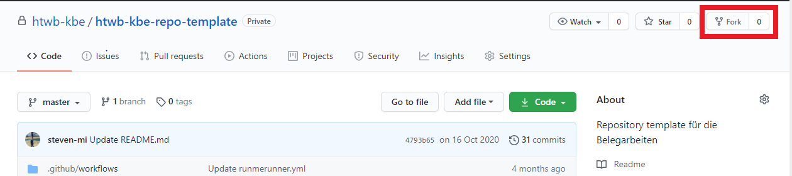
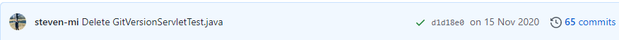
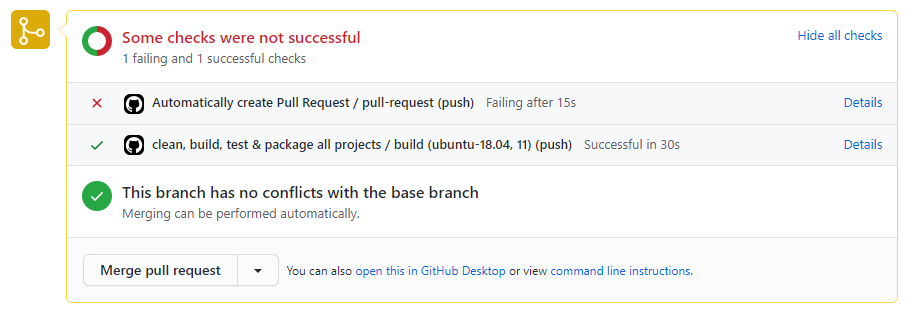

# KBE Projekt Template

| Name          | Matrikelnummer  |
| :------------ | --------------- |
| TEAMMITGLIED1 | MATRIKELNUMMER1 |
| TEAMMITGLIED2 | MATRIKELNUMMER2 |


## KBE Repository einrichten

1. Einen Fork vom Repository erstellen:



2. Lokal Repository klonen:
```bash
git clone LINK_ZUM_REPOSITORY
```

3. Ersetzen Sie die Überschrift in `README.md `mit `TEAMNAME`
4. Geben Sie Ihre Teammitglieder in die Tabelle der `README.md` ein
6. Folge den Anweisungen in der `pom.xml`
7. Führe die Befehle in [Befehle die immer funktionieren müssen](#befehle-die-immer-funktionieren-müssen) aus.
8. Ihre Änderungen in das Repository hinzufügen.
9. Lesen sie sich die README.md durch.

## Konventionen für Branch Namen
Für die Belege gilt folgender Branch Namen:
- runmerunner: `runmerunner`
- songsservlet: `songsservlet`
- songsWSa: `songsWSa`
- songsWSb: `songsWSb`

## Belegpräsentation, Pull Request und Github Actions

Die Befehle im Abschnitt [Befehle die immer funktionieren müssen](#befehle-die-immer-funktionieren-müssen) sollten immer lokal funktionieren. Sie können eine IDE Ihrer Wahl zum Entwickeln verwenden. Allerdings müssen sie bei der Belegpräsentation unbedingt das Terminal verwenden und die Befehle nutzen. Andernfalls wird der Beleg nicht ausgewertet. Zusätzlich muss die auszuwertende Übergabe mit einem grünen Häkchen versehen sein siehe:



Bei einem Pull Request muss nur der Workflow **clean, build, test & package all projects** funktionieren. Es ist normal, dass zunächst die anderen Workflows fehlschlagen siehe:



Jeder Pull-Request sollte keinen Merge-Konflikt besitzen. Dieser muss vor der Abgabe gelöst werden. Nach einer Erfolgreichen Belegpräsentation müssen sie sich die Testdateien von diesem Repository hinzufügen. Dazu folgen sie die Befehle im Abschnitt  [KBE Repository Updates erhalten](#kbe-repository-updates-erhalten).

## KBE Repository Updates erhalten
In diesem Repository werden die Belegaufgaben und die Testdateien hochgeladen. Damit sie die Daten erhalten, müssen sie folgende Befehle ausführen:

### Setup (einmalig)

```
# zum Repository gehen
cd PFAD_ZUM_REPOSITORY

# den kbe Remote setzen (muss man nur einmal machen)
git remote add kbe https://github.com/htwb-kbe/htwb-kbe-repo-template.git
```

### Für Belegaufgaben
```
# zum Repository gehen
cd PFAD_ZUM_REPOSITORY

# In den Main Branch wechseln und updates erhalten
git checkout main

# Updates holen
git pull kbe main

# Updates in das eigene Repository hinzufügen
git push origin main
```


### Für Testdateien
```
# zum Repository gehen
cd PFAD_ZUM_REPOSITORY

# In den Main Branch wechseln und updates erhalten
git checkout BELEG_BRANCH

# Updates holen
git pull kbe main

# Updates in das eigene Repository hinzufügen
git push origin BELEG_BRANCH
```

## Befehle die immer funktionieren müssen

### runmerunner clean, bauen, testen & verpacken

```
mvn -pl runmerunner clean package 
```

ODER

```
cd runmerunner
mvn clean package 
```


### songsservlet clean, bauen, testen & verpacken

```
mvn -pl songsservlet clean package 
```

ODER

```
cd songsservlet
mvn clean package 
```


###  songsWS clean, bauen, testen & verpacken
```
mvn -pl songsWS clean package 
```

ODER

```
cd songsWS 
mvn clean package
```


### Alle Projekte clean, bauen, testen & verpacken
```
mvn clean package
```


